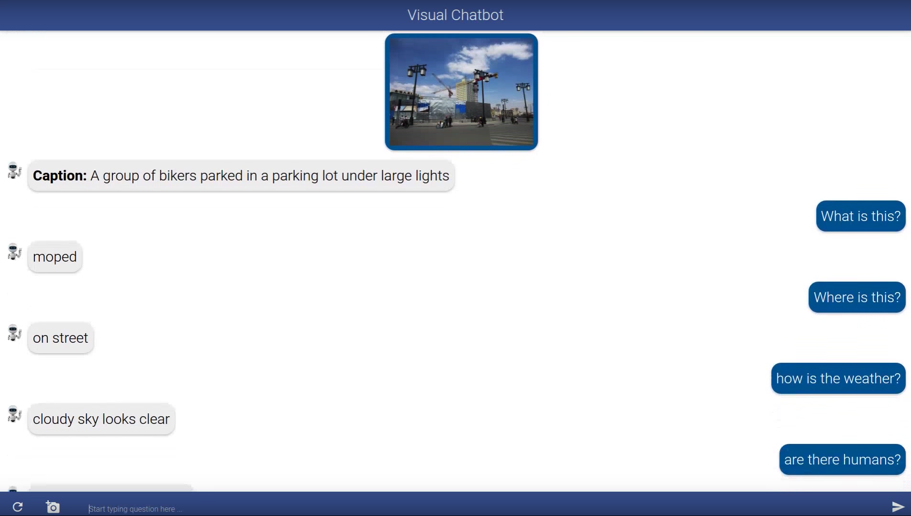

# Visual Chatbot

## Introduction

Demo for the paper

**[Visual Dialog][1]**  
Abhishek Das, Satwik Kottur, Khushi Gupta, Avi Singh, Deshraj Yadav, José M. F. Moura, Devi Parikh, Dhruv Batra  
[arxiv.org/abs/1611.08669][1]  
[CVPR 2017][4] (Spotlight)

Live demo: http://visualchatbot.cloudcv.org

**Visual Dialog** requires an AI agent to hold a meaningful dialog with humans in natural, conversational language about visual content. Given an image, dialog history, and a follow-up question about the image, the AI agent has to answer the question. Putting it all together, we demonstrate the first ‘visual chatbot’!

[](http://www.youtube.com/watch?v=SztC8VOWwRQ&t=13s "Visual Chatbot")

## Installation Instructions

### Installing the Essential requirements

```shell
sudo apt-get install -y git python-pip python-dev
sudo apt-get install -y python-dev
sudo apt-get install -y autoconf automake libtool curl make g++ unzip
sudo apt-get install -y libgflags-dev libgoogle-glog-dev liblmdb-dev
sudo apt-get install libprotobuf-dev libleveldb-dev libsnappy-dev libopencv-dev libhdf5-serial-dev protobuf-compiler
```

### Install Torch

```shell
git clone https://github.com/torch/distro.git ~/torch --recursive
cd ~/torch; bash install-deps;
./install.sh
source ~/.bashrc
```

### Install PyTorch(Python Lua Wrapper)

```shell
git clone https://github.com/hughperkins/pytorch.git
cd pytorch
source ~/torch/install/bin/torch-activate
./build.sh
```

### Install RabbitMQ and Redis Server

```shell
sudo apt-get install -y redis-server rabbitmq-server
sudo rabbitmq-plugins enable rabbitmq_management
sudo service rabbitmq-server restart 
sudo service redis-server restart
```

### Lua dependencies

```shell
luarocks install loadcaffe
```

The below two dependencies are only required if you are going to use GPU

```shell
luarocks install cudnn
luarocks install cunn
```

### Cuda Installation

Note: CUDA and cuDNN is only required if you are going to use GPU

Download and install CUDA and cuDNN from [nvidia website](https://developer.nvidia.com/cuda-downloads) 

### Install dependencies

```shell
git clone https://github.com/Cloud-CV/visual-chatbot.git
cd visual-chatbot
git submodule init && git submodule update
sh models/download_models.sh
pip install -r requirements.txt
```

Change lines 2-4 of `neuraltalk2/misc/LanguageModel.lua` to the following:

```shell
local utils = require 'neuraltalk2.misc.utils'
local net_utils = require 'neuraltalk2.misc.net_utils'
local LSTM = require 'neuraltalk2.misc.LSTM'
```

### Running the RabbitMQ workers and Development Server

Open 2 different terminal sessions and run the following commands:

```shell
python worker.py
python worker_captioning.py
python manage.py runserver
```

You are all set now. Visit http://127.0.0.1:8000 and you will have your demo running successfully.

## Cite this work

If you find this code useful, consider citing our work:

```
@inproceedings{visdial,
  title={{V}isual {D}ialog},
  author={Abhishek Das and Satwik Kottur and Khushi Gupta and Avi Singh
    and Deshraj Yadav and Jos\'e M.F. Moura and Devi Parikh and Dhruv Batra},
  booktitle={Proceedings of the IEEE Conference on Computer Vision and Pattern Recognition},
  year={2017}
}
```

## Contributors

* [Deshraj Yadav][2] (deshraj@vt.edu)
* [Abhishek Das][3] (abhshkdz@gatech.edu)

## License

BSD

[1]: https://arxiv.org/abs/1611.08669
[2]: http://deshraj.github.io
[3]: https://abhishekdas.com
[4]: http://cvpr2017.thecvf.com/
